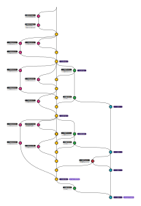

# TP GitFlow 1

## But : créer l'arbre suivant :

## Règles:
- pour cela, nous allons créer et éditer un fichier `CHANGELOG`, tel que décrit ici :  https://keepachangelog.com/en/1.0.0/
- le projet doit être livré sur `origin`, les branches `origin/develop` et `origin/master` doivent être dans l'état présenté
- chacun possèdera un projet GitLab dédié (pensez à correctement configurer les remotes) 
- certains commits doivent êtres tagués
- les commits doivent être effectuées dans l'ordre chronologique du schéma
- comme le `rebase` est autorisé, l'ordre pourra diverger sur le résultat. Toutefois, il doit rester le même sur `origin/develop` et `origin/master`.
